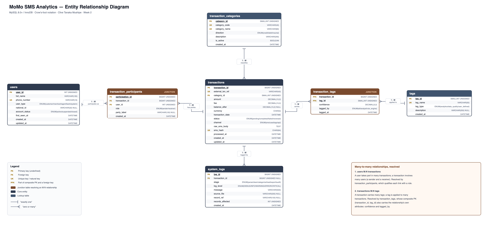

# MoMo SMS Analytics

**Solo submission: Clive Mushipe** | ALU, Database Design and Implementation

| Name | Role |
|------|------|
| Clive Tanaka Mushipe | Database design, SQL implementation, JSON data modelling, documentation |

## Project Overview

A MySQL database for MoMo SMS transaction data. An XML export of MTN Mobile
Money messages is parsed, cleaned, categorised and loaded into a normalised
schema of seven tables, two of which are junction tables resolving the
many-to-many relationships. Data quality is enforced by the database itself,
through CHECK constraints, foreign keys and triggers, rather than by convention,
and personal data is masked by a view so that reporting never handles full phone
numbers.

The source of this project is Python and SQL only. The dashboard, along with
every diagram, screenshot and document, is generated from the database by scripts
in `scripts/build/`, so none of them can fall out of step with the schema.

## Repository Structure

```
Database_Design_and_Implementation/
├── database/
│   ├── database_setup.sql        # Schema, constraints, indexes, triggers, views, seed data
│   ├── sample_queries.sql        # 10 demonstration queries
│   ├── crud_tests.sql            # Create/read/update/delete with before and after state
│   └── security_rules_demo.sql   # 13 security and accuracy rules tested against the engine
├── examples/
│   ├── json_schemas.json         # Draft-07 schemas and API examples
│   └── complete_transaction.json # The complex nested object on its own
├── docs/
│   ├── erd_diagram.drawio        # Editable ERD source (diagrams.net)
│   ├── database_design_document.pdf
│   ├── sql_to_json_mapping.md    # Column by column SQL to JSON mapping
│   ├── screenshots/              # Test evidence, all captured from live runs
│   └── architecture/             # System architecture diagram
├── data/raw/
│   └── modified_sms_v2.xml       # MoMo SMS dataset (25 records)
├── etl/                          # parse, clean, categorise, load (scaffolding)
├── api/                          # FastAPI app (scaffolding)
├── scripts/build/                # Regenerates the diagrams, screenshots, JSON and PDF
└── README.md
```

## Prerequisites

- MySQL 8.0 or higher
- Python 3.9 or higher, for the build scripts only

## Setup & Running

### 1. Clone the repository

```bash
git clone https://github.com/clivetmushipe088/Database_Design_and_Implementation.git
cd Database_Design_and_Implementation
```

### 2. Build the database

```bash
mysql -u root -p < database/database_setup.sql
```

The script is idempotent. It drops and recreates `momo_sms_db`, so it is safe to
re-run.

### 3. Run the demonstration scripts

```bash
# 10 sample queries
mysql -u root -p --table < database/sample_queries.sql

# CRUD tests, which restore the baseline when they finish
mysql -u root -p --table < database/crud_tests.sql

# Security and accuracy rules.
# --force is required: every numbered statement is designed to fail, and without
# it the client stops at the first rejection.
mysql -u root -p --table --force < database/security_rules_demo.sql
```

## Database Design



Editable source: [`docs/erd_diagram.drawio`](docs/erd_diagram.drawio)

| Table | Role |
|-------|------|
| `users` | Every party in a transaction: customers, merchants, agents, banks, services |
| `transaction_categories` | The transaction taxonomy, 10 category codes |
| `transactions` | The fact table, one row per financial SMS |
| `transaction_participants` | **Junction**, resolves `users` M:N `transactions` by role |
| `tags` | Analytics buckets and data-quality flags |
| `transaction_tags` | **Junction**, resolves `transactions` M:N `tags` |
| `system_logs` | ETL audit trail, including messages that never became transactions |

| Object | Count |
|--------|-------|
| Base tables | 7 |
| Views | 3 |
| Foreign keys | 6 |
| CHECK constraints | 13 |
| Triggers | 5 |
| Indexes | 23, including one InnoDB FULLTEXT |

25 of the 32 seeded transactions come from
[`data/raw/modified_sms_v2.xml`](data/raw/modified_sms_v2.xml), with real
amounts, dates, phone numbers, merchant codes and SMS bodies. The other 7 are
synthetic and labelled as such in the script, covering the categories the sample
does not exercise. No real customer data is in this repository.

Full rationale, the complete data dictionary and the cardinality of every
relationship are in the
[Database Design Document](docs/database_design_document.pdf).

## Security and Accuracy Rules

Thirteen rules are enforced by the engine, not by convention. A documented rule
is a suggestion; an enforced rule is a guarantee.

| Mechanism | Rules |
|-----------|-------|
| `UNIQUE` | Duplicate SMS rejected by SHA-256 of the message body, one sender per transaction |
| `CHECK` | Amount above zero, fee non-negative, valid MSISDN format, confidence within 0 to 1 |
| `FOREIGN KEY` | No orphan transactions, lookup rows protected by `ON DELETE RESTRICT` |
| `TRIGGER` | No self-transfers, no future-dated rows, mandatory audit of amount changes |
| `VIEW` | Phone numbers masked in all reporting |
| `GRANT` | `momo_app` cannot `DELETE` or `DROP`; `momo_readonly` sees only the masked views |

Each one is demonstrated failing, or protecting, in
[`database/security_rules_demo.sql`](database/security_rules_demo.sql), with
captured output in [`docs/screenshots/`](docs/screenshots/).

## JSON Data Modelling

[`examples/json_schemas.json`](examples/json_schemas.json) holds JSON Schema
draft-07 definitions for every entity plus worked API examples. Every example is
generated by querying the live database and validated against its own schema, so
the two cannot drift apart.

| MySQL | JSON | Reason |
|-------|------|--------|
| `DECIMAL(15,2)` | decimal **string** | Binary floating point cannot hold every two-decimal value exactly |
| `DATETIME` | ISO-8601 `+02:00` | MySQL stores no timezone, so the API attaches Africa/Kigali |
| Foreign key | nested object | A client renders a transaction from one request, not two |
| Junction table | nested array | `role`, `confidence` and `tagged_by` are attributes of the relationship |

## Documentation

| Document | Contents |
|----------|----------|
| [Database Design Document (PDF)](docs/database_design_document.pdf) | 29 pages: ERD, design rationale, full data dictionary, queries and security rules with screenshots |
| [SQL to JSON mapping](docs/sql_to_json_mapping.md) | Column by column mapping and serialisation rules |
| [System architecture](docs/architecture/system_architecture.png) | Data flow from the XML export through the ETL to MySQL and the generated dashboard |

## Regenerating the Documentation

```bash
python3 scripts/build/make_erd.py           # ERD
python3 scripts/build/make_architecture.py  # architecture diagram
python3 scripts/build/make_screenshots.py   # runs every .sql, captures real output
python3 scripts/build/make_json.py          # JSON schemas and examples
python3 scripts/build/make_doc.py           # design document PDF
```

Requires the database to exist, and Google Chrome, which is used headlessly to
render the images and print the PDF.

## Project Status

| Component | State |
|-----------|-------|
| MySQL schema, queries, CRUD and rule tests | Complete |
| JSON schemas and SQL to JSON mapping | Complete |
| Design document | Complete |
| `etl/` pipeline | Scaffolding, does not populate the database yet |
| `api/` endpoints | Scaffolding, `api/db.py` connects to MySQL but the routes return empty responses |
| Dashboard | Not built, will be generated from the database |

## Scrum Board

[View the project Scrum Board here](https://github.com/users/clivetmushipe088/projects/2)
