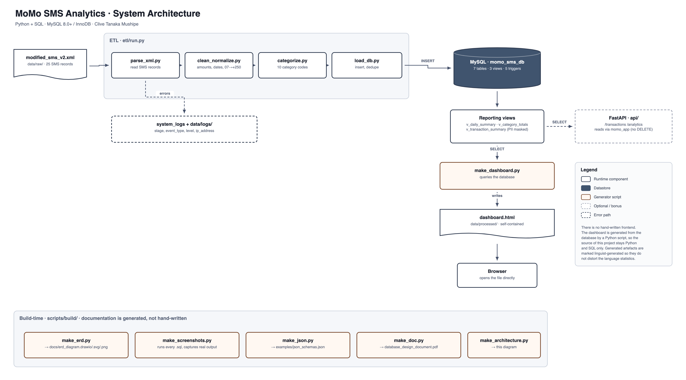

# MoMo SMS Analytics

**Team name:** Solo: Clive Mushipe

## Project description

MoMo SMS Analytics is a full-stack application that turns raw MTN Mobile Money (MoMo) SMS messages into insights. The system:

1. **Processes** an XML export of MoMo SMS messages.
2. **Cleans and normalizes** amounts, dates and phone numbers.
3. **Categorizes** each message into a transaction type (incoming money, payments to code holders, transfers to mobile numbers, bank deposits, airtime and bill payments, agent withdrawals, and more).
4. **Stores** the cleaned transactions in a relational SQLite database.
5. **Visualizes** the data in a web dashboard with charts and tables.

The project covers backend data processing, database management and frontend development.

## Team members

| Name | Email | Responsibilities |
|------|-------|------------------|
| Clive Tanaka Mushipe | c.mushipe@alustudent.com | ETL pipeline, database, frontend, documentation |

## System architecture



Diagram link (draw.io): [open the diagram](https://app.diagrams.net/#Uhttps%3A%2F%2Fraw.githubusercontent.com%2Fclivetmushipe088%2FDatabase_Design_and_Implementation%2Fmain%2Fdocs%2Farchitecture%2Fsystem_architecture.drawio)

The XML file goes through the ETL steps (parse, clean, categorize, load, export). The data is saved in SQLite and summarized into `dashboard.json`. The dashboard reads that JSON through a simple web server, or the FastAPI endpoints (bonus).

## Scrum board

Board link: [MoMo SMS Analytics Scrum Board](https://github.com/users/clivetmushipe088/projects/2)

Columns: Todo, In Progress, Done.

## Project structure

```
.
├── README.md
├── .env.example
├── requirements.txt
├── index.html              # dashboard page
├── web/                    # styles.css, chart_handler.js, assets/
├── data/
│   ├── raw/                # momo.xml goes here (git-ignored)
│   ├── processed/          # dashboard.json
│   └── logs/               # etl.log, dead_letter/
├── etl/                    # parse -> clean -> categorize -> load -> export
├── api/                    # FastAPI app (bonus)
├── scripts/                # run_etl.sh, export_json.sh, serve_frontend.sh
└── tests/                  # unit tests
```

## Getting started

```bash
pip install -r requirements.txt
scripts/run_etl.sh          # run the ETL (put momo.xml in data/raw/ first)
scripts/serve_frontend.sh   # open http://localhost:8000
python3 -m pytest           # run the tests
```

## Tech stack

- Python (ElementTree/lxml, python-dateutil)
- SQLite
- FastAPI (bonus)
- HTML, CSS, JavaScript
- pytest
- GitHub Projects and draw.io

## Status

Week 1: setting up the repository and planning the project.
